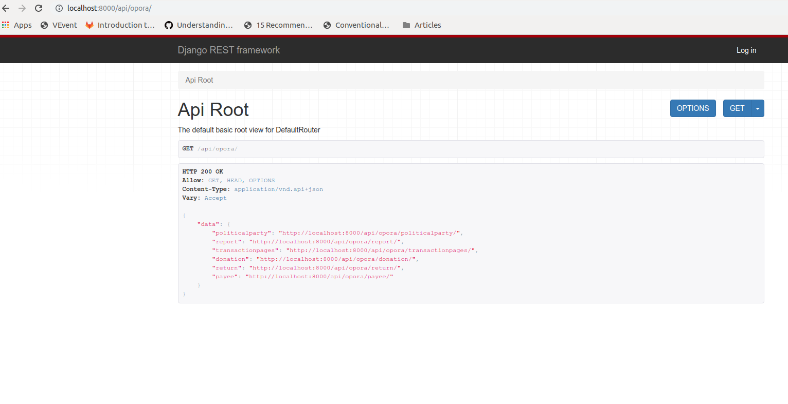

# moonsheep
[](https://travis-ci.org/themoonsheep/moonsheep)
[](https://coveralls.io/github/themoonsheep/moonsheep?branch=master)
[](https://codeclimate.com/github/themoonsheep/moonsheep/maintainability)

Got stacks of documents and crowd to help out digitize them?

Moonsheep digitizes massive collections of documents into structured data through crowdsourcing and cutting edge technology.

See more at http://moonsheep.org/

## Run app
```
cd myapp
workon myapp
python runserver 0.0.0.0:8000
```

## Dev tools

Moonsheep packs some tools and configuration options that speeds up development of projects.

### DEV_ROTATE_TASKS

To be used while develop tasks (forms, data saving, creation of subtasks).

Setting `MOONSHEEP['DEV_ROTATE_TASKS'] = True` has the following effects:
1. You don't need to create tasks in the database
1. When opening a transcription view defined task types are rotated.
   - Each refresh gives a new task type with mocked data.   
   - On every task type you need to define a function that will return mocked params:
   `@classproperty def mocked_params(cls) -> dict:`   
   - You might pass `?task_type=` query parameter to disable rotation and stay focused on one task type.
1. When you submit transcription form the entry is not created. Code skips cross-checking and invokes directly saving models (`save_verified_data`)
   and creating new tasks `after_save(data)` so these features can be tested.
   
   If you have subtasks then most likely saving will fail because of some missing models.
   It is recommended to write project tests covering saving data and creating dependant tasks.

## Settings

Can be overriden in your project's settings as follows:
```python
from moonsheep.settings import *  # NOQA

MOONSHEEP.update({
    'DEV_ROTATE_TASKS': False,
    'MIN_ENTRIES_TO_CROSSCHECK': 1,
})
```

Apart from `MOONSHEEP`-specific settings, the import will also bring in defaults for `REST_FRAMEWORK`.

Settings:
- [`DEV_ROTATE_TASKS`](#DEV_ROTATE_TASKS) - support for developing tasks, check details above
- `MIN_ENTRIES_TO_CROSSCHECK` - number of entries for a task needed to run cross-checking (defaults to 3)
- `MIN_ENTRIES_TO_MARK_DIRTY` - number of entries for a task at the point where when if crosschecking fails 
   then the task will be marked as `dirty`. It won't be server anymore to users and will be brought
   for a moderator attention. (defaults to 4)
- `USER_AUTHENTICATION` - methods to handle user logins, see [below](#Users_&_authentication) for details
  - `nickname` - generate pseudonymous nicknames, so you can show statistics to users, 
  but don't have to keep their peronal data
  
    you can set `'FAKER_LOCALE': 'it_IT'` to change the language of generated names
  - `anonymous` - users don't need to login; cookies are sent anyhow to trace entries by each user

## Importing documents

Configuring backend:
1. Create a Model that will have an `url` field and annotate it with `@document` 
specifying which tasks should be created when importing document, ie.:

```python
from moonsheep.registry import document

@document(on_import_create=['opora.tasks.FindTableTask'])
class Report(models.Model):
    """
    The whole document to transcript
    """
    # initial data
    url = models.URLField(verbose_name=_("report URL"), unique=True)

    # all other fields should have null=True set so such object may be created just based on url.
    # later tasks will fill in other details 
```

If several tasks should be created for one document just list them:
```python
@document(on_import_create=['kmonitor_ad.tasks.Section1PersonalData', 'kmonitor_ad.tasks.Section2Properties', 'kmonitor_ad.tasks.Section3Movables'])
```

Then import documents. Right now only the import from HTTP index listings via command line is supported:

```bash
python manage.py moonsheep_import_http --host http://user@host/root  dir1 dir2/file1
python manage.py moonsheep_import_http http://user@host/root/dir1
python manage.py moonsheep_import_http http://user@host/root/dir1 -f *.pdf --dry-run
```

Options:
- `--host` specify host for all files/dirs specified later
- `-f` include files matching pattern
- `--dry-run` - see which files will be imported without actually importing them

## Users & authentication

Moonsheep user is a custom class substituting `auth.User` as explained here: https://docs.djangoproject.com/en/2.2/topics/auth/customizing/#substituting-a-custom-user-model

It uses email as an unique key and supports a range of authentication methods that can be configured by setting `MOONSHEEP['USER_AUTHENTICATION']` to:
- `nickname` Auto-generated pseudonymous nicknames so volunteers can follow their statistics without leaving email or creating an account 
    
   In order to setup such authentication you need to add to your project's urls an entry dedicated to choosing randomly a nickname:
   ```python
   from moonsheep.views import ChooseNicknameView

   urlpatterns = [
     # name needs to be set to 'choose-nickname'
     path('get-a-nickname', ChooseNicknameView.as_view(template_name='nickname.html'), name='choose-nickname'),
   ]
   ``` 
- `anonymous` Users are created on the fly and automatically logged in so we know which contributions comes from who, but we don't store any identifying information. 

## Manual verification

There might be documents which have parts hard to decipher. In case that multiple volunteers got very different results, there is a way to bring such task for a manual verification by a moderator.

To do that configure the following:
1. In settings set up `MIN_ENTRIES_TO_MARK_DIRTY` (defaults to 4) If there are that many entries for a task and yet it has not been crossverified,
   then the task is marked as DIRTY and sent to manual verification.
2. In your transcription template import manual verification handing

   ``

Now dirty tasks will be listed in main dashboard. Opening one will show the traditional task's form with fields lighted in green (those that received same answers) 
and fields lighted in red that didn't. Each marked red will have a hover-on tooltip containing all the answers sent by users, so you as a moderator can choose the right one or type it in yourself.

## Templates

### Widgets

There is number of template tags that provide information on progress.

#### stats_documents_verified
```html

<ul>
    
    <li>{{ docs.total_progress|floatformat:2 }}% total progress</li>
    <li>{{ docs.verified }} / {{ docs.total }} [{{ docs.verified_percent }}%] documents verified</li>
    <li>{{ docs.remaining }} remaining to be verified</li>
</ul>
```

### Thank you note

Moonsheep sends some messages to your users, to show them include the following in your transcription (and possibly other) templates:

```html
    <link rel="stylesheet" href="">
</head>

    
    <ul class="ms-messages">
        
        <li class="{{ message.tags }}">{{ message|safe }}</li>
        
    </ul>
    
```

After each transcription it will show "Thank you! Are you ready for a next one? Take a pause?". 
 "Take a pause?" will be a link to `finish-transcription` view that you need to define:
 ```python
    url(r'^$', TemplateView.as_view(template_name='homepage.html'), name='finish-transcription'),
    url(r'^$', TemplateView.as_view(template_name='homepage.html'), name='home'),
```

## Exporting data

Moonsheep supports several ways to export structured domain data. That include:
- JSON:API compliant API
- XLSX
- [Frictionless Data](https://frictionlessdata.io/) (packed CSVs)  

Export options are available in the Moonsheep admin on the campaign page and also via command line on the server.

### Configuration

Structured data export is available out of the box, but can be further refined.

#### Exported queryset

It is possible to define what objects should be returned for each model 
by defining a custom queryset method `exported()`. 

`DocumentModel` base class uses that mechanism to return by default only those objects
that have been fully transcribed. You can define it on any of your domain models
and it will be picked up by the export mechanism.

```python
class DocumentQuerySet(models.QuerySet):
    def exported(self) -> models.QuerySet:
        return self.filter(progress=100)

class DocumentModel(models.Model):
    objects = DocumentQuerySet.as_manager()
```  

#### Excluded fields

You might have some metadata/control fields that you don't want to be exported
in structured data. To define them add an inner class `Exported`
and define there either a full list of fields to export or fields to be excluded.

```python
class MyModel(models.Model):
    class Exported:
        # fields = ['first', 'second'] # to list all fields which should appear
        exclude = ['progress'] # or exclude a few
        # if Exported is not specified then by default all fields are exported
```

#### DocumentModel

`moonsheep.models.DocumentModel` should be used as a default base class 
for defining a model that defines a document being transcribed. It offers following features:
- defines `url` and `progress` model fields required by Moonsheep
- exclude `progress` field from being exported
- limits exported objects to those fully transcribed `progress == 100` 

### Exporters

#### API

Implementing an API for domain model is as simple as adding one url line:
```python
from moonsheep.exporters.api import AppApi

urlpatterns = [
    path('api/opora/', include(AppApi('opora').urls)),
]
```

`AppApi` scans for all domain models defined in your app (passed in the param) 
and generates URL for each using Django Rest Framework. 
Rest Framework gives you a nice html interface to play with requests with 
discovery features (listing of all endpoints). That's the effect at `/api/opora`: 



#### XLXS

Exports data placing each model in a separate sheet of `xlsx` file.

Can be called from a command line:
```bash
python manage.py moonsheep_export [app_label] xlsx -o opora.xlsx
```

#### Frictionless Data (packed CSV)

Exports data placing each model in a separate `csv` file
and packing all of them into a zip file according to Frictionless Data specification.

Can be called from a command line:
```bash
python manage.py moonsheep_export [app_label] frictionless -o opora.zip
```

#### Guidelines on how to write your own exporter

Exporters should extend `moonsheep.exporters.Exporter` abstract class and implement
`def export(self, output: Union[io.IOBase, str], **options)` method.

`PandasExporter` can be used as a base as `pandas` supports already [several output types](http://pandas-docs.github.io/pandas-docs-travis/reference/frame.html#serialization-io-conversion).
